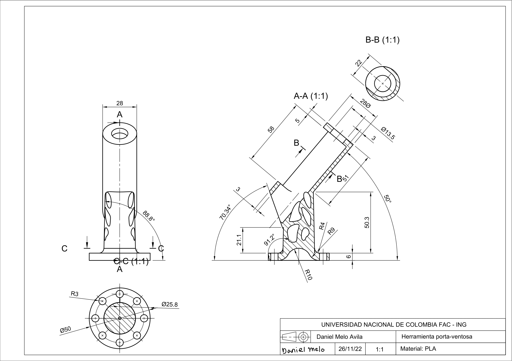
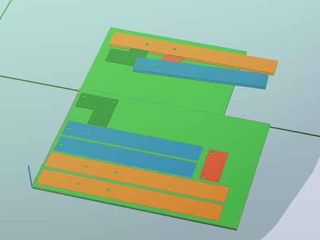
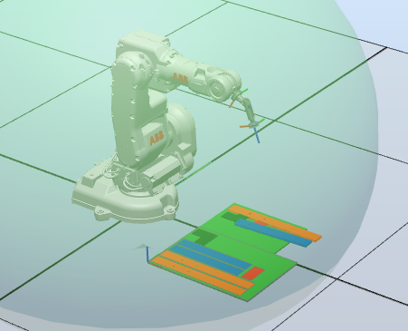

<h1 align="center"; style="text-align:center;">Proyecto Final</h1>

## Robótica
### Jorge Daza, Camilo Martín, Daniel Pineda, Daniel Melo, Santiago Mariño

# Video Resumen

(Video)

# Introducción

A nivel industrial se busca optimizar de manera correcta algunos procesos, de modo que aumente la eficiencia de los mismos. En este proyecto se busca diseñar e implementar una herramienta personalizada para realizar un proceso de ensamble de un gripper, mediante una ventosa controlada por una señal digital conectada a una electroválvula. Para ellos se realizaron corroboraciones de la programación mediante simulaciones en Robot Studio y pruebas de firmeza para la ventosa.

# Diseño del Gripper

El diseño planteado fue inspirado en unas pinzas de presión.

Al analizar esta herramienta se notó que es un mecanismo de cuatro barras. Con esto en mente se empezaron a diseñar los eslabones que conformarían el ensamble. Para este proceso se tuvo en cuenta la siguiente consideración; que el ancho de estos no debería ser menor de 50mm, con el objetivo de facilitar la adhesión de las piezas a la ventosa. Por otro lado, el diámetro de los agujeros para los pasadores se determinó de 8mm, decisión orientada a prevenir contratiempos en el proceso del ensamble. Tomando en cuenta las consideraciones previamente mencionadas, se modeló el gripper en Inventor, variando las distancias entre agujeros (longitudes del mecanismo de cuatro barras) hasta tener un resultado satisfactorio, resultando en las siguientes piezas. 

Como se ve en la imagen superior, las distancias del mecanismo de cuatro barras resultaron siendo de 50, 80, 80 y 75 mm. Con lo que se obtiene el siguiente montaje.

 [video](https://www.youtube.com/watch?v=gOWi3OqY_q4&ab_channel=DanielPineda)
 
Para fabricar el gripper se optó por usar corte laser en MDF por su bajo costo, reducido tiempo de producción y además porque el material residual del proceso se puede utilizar directamente como la base de recogida para el proceso de ensamblaje. 

# Diseño herramienta

Para el diseño de la herramienta se tuvo en cuenta el dimensionamiento de la ventosa, para lo cual fue necesario acceder a este dispositivo en el laboratorio y tomar sus respectivas medidas, como se presenta en la siguiente figura:

A partir de esto se modelo en Inventor la ventosa, para realizar un dimesionamiento correcto.

Luego de esto se comenzó el diseño de la herramienta con los parámetros dados, tal como la orientación de la ventosa con respecto al eje Z, del plato portaherramientas.

Se observa que para obtener poco despercio de material se realizó un diseño con partes huecas, esto no afectará la implementación de la herramienta pues esta, estará sometida a pocas cargas o esfuerzos (cortantes), en esta zona. Así mismo se observa que en la base que irán diversos agujeros para unir este dispositivo con el controlador ABB.

El plano de dicha herramienta se encuentra a continuación.

Finalmente se realizo la impresión 3D de esta herramienta en ácido poliláctico (PLA), el resultado final se presenta a continuación.

# Materiales del proyecto
Para la fabricación de las piezas utilizadas en este proyecto se utilizó, MDF para las plataformas de recogida y ensamblaje, así como para las piezas del gripper por su baja rugosidad y precio, para la segunda plataforma, se utilizó balso como material de los pasadores, esto por su bajo precio y resistencia mecánica, pues en caso de que se produjera algún error en la ejecución del programa, se romperían los pasadores mas no las piezas del gripper ni el portaherramientas. Por último, se utilizó PLA para el fabricar el portaherramientas mediante manufactura aditiva y así poder conseguir las geometrías planteadas en la sección anterior.

# Ensamble

Para el ensamble del sistema, se preparo el espacio de trabajo colocando las piezas del gripper y realizando la respectiva calibración. En cuanto a la herramienta se acomodo la ventosa, al diseño presentado anteriormente, y luego de esto se atornillo al plato portaherramienta con los respectivos tornillos M5, sin pasar de la respectiva medida recomendada.

(Video)

# Espacio de trabajo 

Para generar las trayectorias necesarias para el proceso de ensamble, primero se modeló en inventor el material restante del corte laser, el cual sería usado como plataforma de recogida para la operación, así como la plataforma de ensamblaje. Los work objects correspondientes a estas plataformas se crearon por el método de tres puntos, de la siguiente manera.

Sin embargo, en el caso de la plataforma de recogida, el corte laser no resultó como se esperaba, por lo que en la práctica se tuvo que, primero ajustar las plataformas en el espacio diestro del robot para así definir los work objects por el método previamente mencionado (como se puede ver en el primer video de la sección “Ensamble”), para posteriormente hacer un fino ajuste manual con el fin conseguir que la posición de las piezas coincidiera con las que se encuentran en el programa. 
# Simulación

Para la simulación se realizo el diseño de las piezas con las que se iba a trabajar en Inventor, luego estas se exportaron a Robot Studio para poder crear el espacio de trabajo de manera adecuada, se realizo el seguimiento de las trayectorias a lo largo de toda la pieza con el manipulador.

(Video)

Durante esta simulación se encontraron algunos targets fallidos, para esto fue necesario revisar las orientaciones de los mismos, pues estos tienen configuraciones opuestas a las del manipulador, por lo tanto fue necesario realizar pistas intermedias para que el robot pudiera alcanzar los targets necesarios según la orientación y posición objetivo.

(Video)

Luego de esto se procedió a implementar el código de RAPID en el controlador ABB.

# Resultados
Finalmente, y pese a los inconvenientes que se tuvieron al crear el workobject de la base de recogida, se logró llevar a cabo exitosamente el ensamble del gripper, esto se puede apreciar en el siguiente video.

 [video](https://www.youtube.com/watch?v=lHi_EfEtfV0&ab_channel=santiagomari%C3%B1o)
